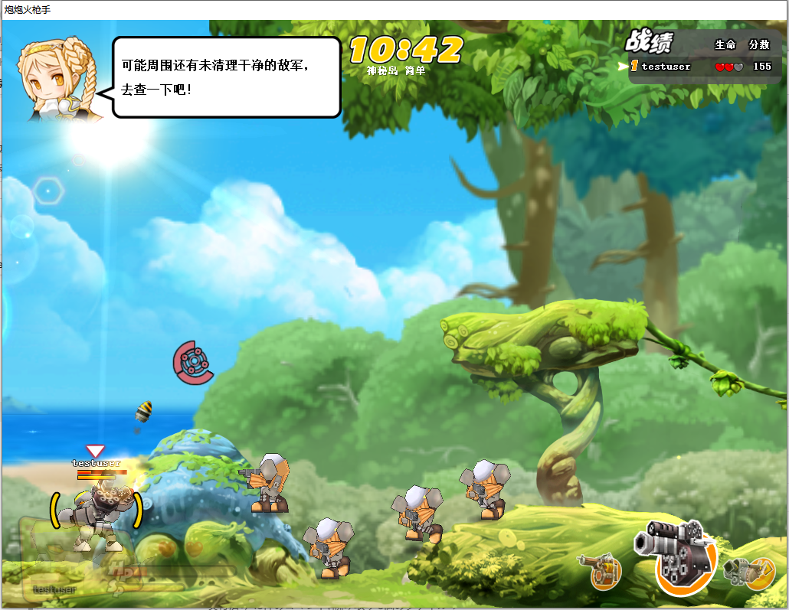
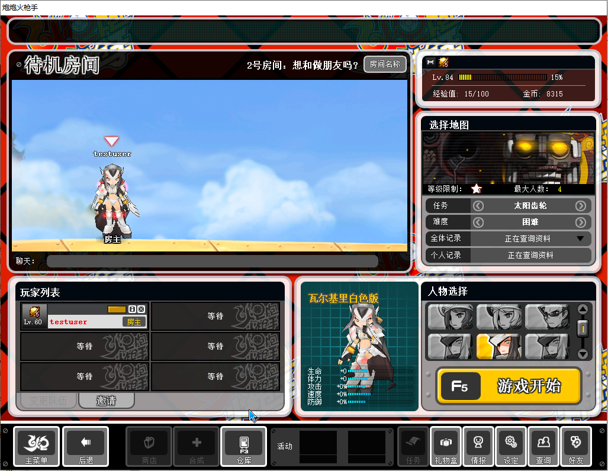

# 炮炮火枪手 · 原版客户端复活工程

这是一个针对 2007 年网络游戏《炮炮火枪手》（NEXON《Big Shot》，世纪天成代理）的客户端保存与复活工程。

该游戏自 2009 年起正式停服，至今没有再开的消息。为了重温童年回忆，现用 AI 技术复活本游戏，项目内代码绝大部分都由 AI 生成。

 > **重要：虽然停服很久，但版权方还在。且玩且珍惜，千万不要拿去跳脸官方。** 

本项目让原版 3.11 客户端能够在 Windows 10 上启动，并通过运行时补丁与本地 Python
替代服务端恢复单机内容。目标是保留登录、大厅、房间、训练场和闯关流程；不连接原官方
服务。

## 当前状态

核心单机闭环已经跑通：

- 绕过已失效的 nProtect GameGuard 检查，进入原版登录界面
- 将认证服和游戏服连接重定向到 `127.0.0.1`
- 登录、账号存档、教程状态、等级、经验和金币持久化
- 大厅、建房、角色选择、训练场和闯关模式
- 关卡开始、换图、死亡、重生、生命数、分数和自动结算
- 怪物与 Boss 掉落、金币/道具生成及拾取
- 通关/失败标签、经验、金币、分数与剩余生命显示
- 结算结束后自动回到房间
- 隐藏地图、角色全解锁

联机功能正在开发中（V0.2）。已经完成的部分：

- 多账号：网页注册、明文密码校验、账号之间数据隔离
- 登录界面可自选「本机服务器」或「远程服务器」，远程地址写在 `server.config`（IPv4 / IPv6 / 域名都支持）
- 服务端认证、游戏、注册页合并为一个进程，监听 `::`（IPv4 / IPv6 都能连）
- 「存档转移助手」：把存档从一台服务器导出、导入到另一台
- 默认解除多人对战的等级限制

**还没做**：房间列表 / 加入房间 / 房间内聊天 / 多人战斗同步。
商店等功能目前还没有，未来可能会加。

## 实机画面

| 闯关战斗 | 待机房间（隐藏地图、角色全解锁） |
|---|---|
|  |  |

## 工作原理

```text
start.bat
  └─ tools/launch.ps1
       ├─ server/app.py                      认证 [::]:47611
       │                                     游戏 [::]:27799
       │                                     注册页 [::]:27810（可在 server.config 改）
       │                                     调试控制通道 127.0.0.1:27800
       ├─ server/relay.py                    联机模式的本机中继
       │                                     127.0.0.1:47621 → <server_address>:47611
       │                                     127.0.0.1:27809 → <server_address>:27799
       └─ hook/bin/bsloader.exe
            └─ game_patched/BigShot.exe
                 └─ 注入 hook/bin/bshook.dll
                      ├─ VEH + 主线程 DR0，在校验执行瞬间返回 GameGuard 成功码
                      ├─ 把登录框的分区改成「本机服务器 / 远程服务器」，并按选择决定
                      │  连本机服务端还是连中继
                      ├─ 把「注册成为世纪天成用户」换成我们自己的注册页
                      └─ 可选记录解密后的协议数据
```

客户端是 2007 年的 32 位程序，`connect` 只认 IPv4 地址，所以联机时先连本机中继，
由中继用 `getaddrinfo` 解析 `server.config` 里填的 IPv4 / IPv6 / 域名再转发出去。

`bshook.dll` 不修改磁盘上的 `BigShot.exe`，补丁只在客户端解壳完成后写入进程内存。
启动器与 DLL 先完成握手，主线程真正执行到状态校验点时由硬件断点和 VEH 直接调整
寄存器；角色及地图等单机化补丁写入运行中的进程内存。
本地服务端使用 Python 标准库实现认证、协议编解码和游戏状态机，账号状态保存在
`server/data/accounts.json`。

## 运行要求

当前经过验证的环境：

- Windows 10 Pro 19045 x64
- 原版 3.11 客户端
- Python 3.14
- Visual Studio 2017 Build Tools 的 MSVC x86 工具链
- DirectX 9 运行环境及客户端需要的 VC++ x86 运行库

日常运行服务端不需要第三方 Python 包。部分逆向辅助脚本需要 `capstone`；Ghidra、
x64dbg、Sysinternals 等工具只在继续逆向时需要，正常玩游戏不需要。

当前脚本包含本机路径约定：

- `hook/build.bat` 默认使用 Visual Studio 2017 Build Tools 的 `vcvars32.bat`

如果安装位置不同，请先修改脚本中的对应变量。


## 启动与关闭

正常游玩：

```bat
start.bat
```

详细协议日志模式：

```bat
start-debug.bat
```

关闭客户端和本地服务端：

```bat
stop.bat
```

### 首次使用：先注册账号

登录界面下方有一条「在服务器 … 上注册用户」的链接，点它会打开注册页面
（选「本机服务器」时是 `http://127.0.0.1:27810/`，选「远程服务器」时是
`server.config` 里配置的那台服务器）。
注册后就能在登录界面用这个账号密码登录。**服务端会校验密码**，
账号不存在或密码不对都会被拒绝。

> **账号和密码是明文传输、明文保存的。**
> 请勿使用真实网站或其他服务的密码 —— `server/data/accounts.json` 会以明文保存它。

### 本机服务器还是远程服务器

登录界面的「选择分区」现在是两项：

| 选项 | 连哪儿 |
|---|---|
| 本机服务器 | 本机的服务端，一个人玩，存档在本机 |
| 远程服务器<br>(IP设置:server.config) | `server.config` 里 `server_address` 指向的那台服务器 |

`server.config` 就在 `start.bat` 旁边，用记事本打开即可，里面有中文注释和
IPv4 / IPv6 / 域名三种写法的示例。改完重新运行 `start.bat` 生效。

> 服务端监听 `::`，也就是说**选「本机服务器」时本机的 47611 / 27799 / 27810 三个端口
> 对局域网是开放的**。好处是想开黑时不用另外部署服务端，让朋友填你的内网 IP 就能连；
> 代价是同一个局域网里的人能看到这几个端口。

正常模式只记录关键事件。调试模式会记录逐包 hexdump 和解密后的协议数据，日志体积会
快速增长，文件保存在 `logs/`，且不会提交到 Git。

## 运行测试

服务端测试使用 Python 自带的 `unittest`：

```powershell
runtime\python\python.exe server\run_tests.py
```

内置的便携 Python 带着 `python314._pth`，其中的 `.` 指的是 python.exe 所在目录而不是
当前工作目录，所以直接 `-m unittest test_gameserver` 会找不到模块 —— `run_tests.py`
就是为这件事准备的。用系统 Python 的话 `cd server; python -m unittest test_account_store
test_gameserver test_online` 也可以。


## 调试控制通道

`gameserver.py` 默认在 `127.0.0.1:27800` 提供只用于本机协议试验的控制通道：

```powershell
python tools/gs_ctl.py status
python tools/gs_ctl.py help
```

它可以手动触发结算、掉落、死亡、换图和回房间等包，用于快速验证协议，不是正常游玩
流程的一部分。

## 目录结构

| 路径 | 内容 |
|---|---|
| `hook/` | 注入 DLL、启动器源码及构建脚本 |
| `server/` | 服务端：认证、游戏、注册页、中继、协议和测试（单机和云端共用同一套代码）|
| `server.config` | 联机服务器地址和注册页端口 |
| `tools/` | 自写逆向、探针、截图和自动化脚本 |
| `re/` | RTTI、虚表、包记录和映射文本等分析成果 |
| `game_patched/` | 实际运行的客户端工作副本 |
| `logs/` | 抓包、运行日志和临时截图 |


## 常见问题

### 提示找不到 `bsloader.exe` 或 `bshook.dll`

先运行 `hook\build.bat`。如果找不到编译器，检查 `hook/build.bat` 中的 `VCVARS` 路径，
并确认使用的是 x86 工具链。

### 客户端没有画面或 D3D9 初始化失败

先断开 Sunshine/Moonlight 等正在进行的串流会话，再运行 `tools/d3d9_probe.exe` 检查
D3D9 HAL。串流程序进程存在不一定有问题，关键是当前是否有活跃串流会话。

### 客户端突然退出

优先查看：

```text
game_patched/Dump/LastCrashReport.txt
logs/bshook_*.log
logs/server.err
logs/relay.err
```

### 关卡中 15 秒不向前移动就被退出

这是原版闯关模式的反挂机机制，不是本地服务端故障。角色重生回出生点后尤其容易触发。

### 运行一段时间后部分贴图变成色块

这是当前已知的原客户端长时间运行问题。退出并重新启动客户端后再判断画面是否异常。


## 版权与用途说明

本项目用于软件保存、兼容性研究和协议逆向学习。
游戏名称、客户端代码、美术、音乐及其他原始内容的权利归其原权利人所有。


