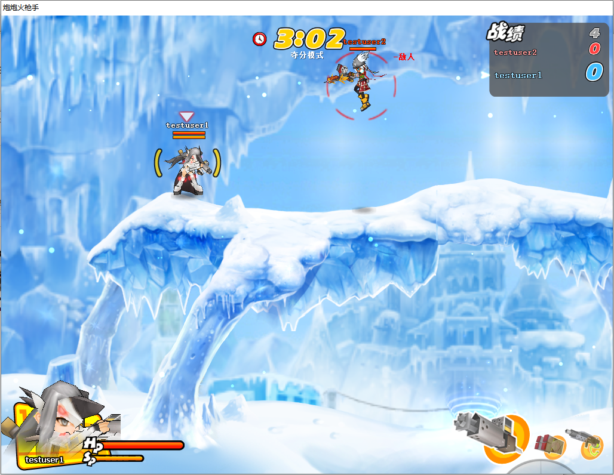
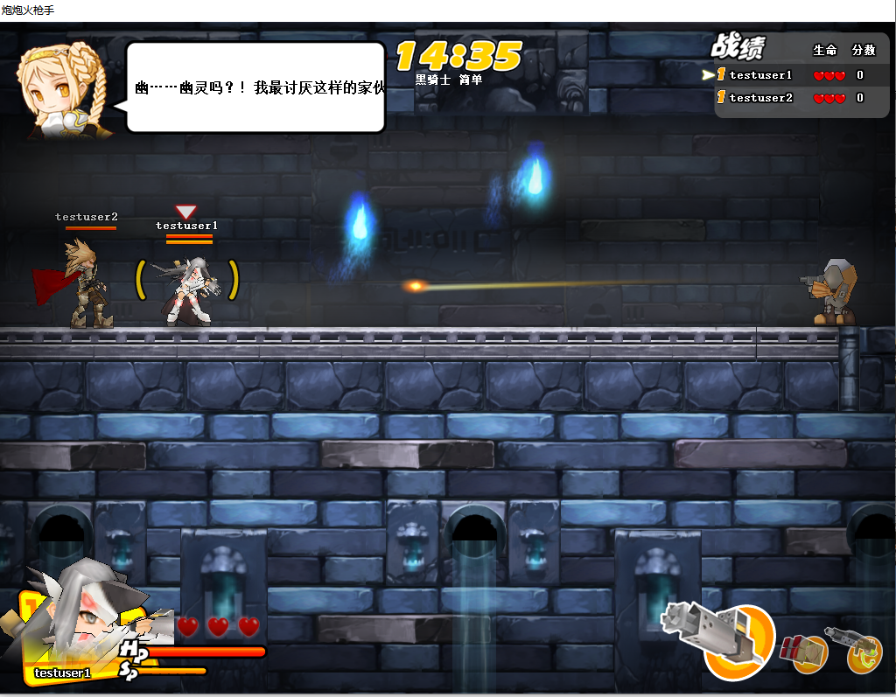
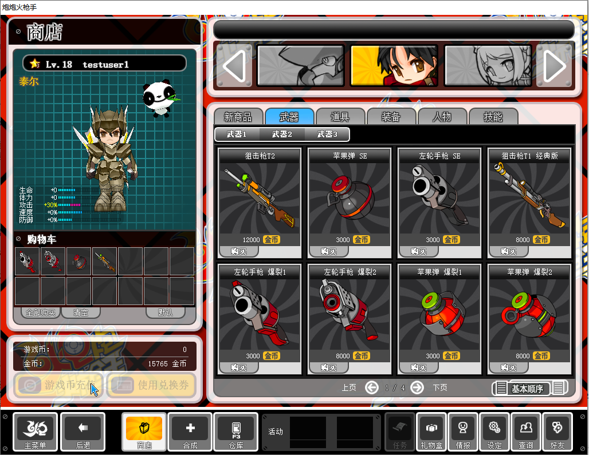
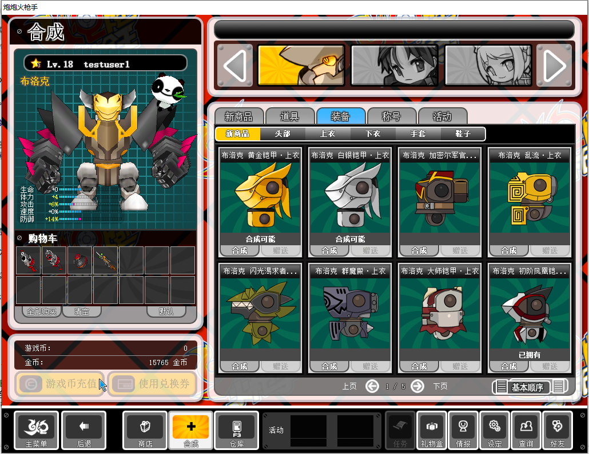

# 炮炮火枪手 · 原版客户端复活工程

这是一个针对 2007 年网络游戏《炮炮火枪手》（NEXON《Big Shot》，世纪天成代理）的客户端保存与复活工程。

该游戏自 2009 年起正式停服，至今没有再开的消息。为了重温童年回忆，现用 AI 技术复活本游戏，项目内代码绝大部分都由 AI 生成。

 > **重要：虽然停服很久，但版权方还在。且玩且珍惜，千万不要拿去跳脸官方。** 

> ## ⚠ 本项目永久免费，禁止倒卖
>
> **如果你这份游戏包是花钱买来的，说明你被骗了** ——
> 请立即要求退款，并向交易平台举报该商家。
>
> - 免费下载（唯一官方地址）：<https://github.com/liubz102/popshot-reborn>
> - 唯一玩家交流群 QQ：**703732744**（群内有群主提供的云服务器，可免费多人联机）
>
> 本项目以 [PolyForm Noncommercial License 1.0.0](LICENSE) 授权，
> **任何形式的商业用途都不在授权范围内**（[中文说明](LICENSE.zh.md)）。

本项目让原版 3.11 客户端能够在 Windows 10 上启动，并通过运行时补丁与本地 Python
替代服务端恢复单机内容。目标是保留登录、大厅、房间、训练场和闯关流程；不连接原官方
服务。

## 当前状态

核心单机闭环已经跑通：

- 绕过已失效的 nProtect GameGuard 检查，进入原版登录界面
- 将认证服和游戏服连接重定向到 `127.0.0.1`
- 登录、账号存档、教程状态、等级、经验和金币持久化
- 大厅、建房、角色选择、训练场和闯关模式
- 关卡开始、换图、死亡、重生、生命数、分数和自动结算
- 怪物与 Boss 掉落、金币/道具生成及拾取
- 通关/失败标签、经验、金币、分数与剩余生命显示
- 结算结束后自动回到房间
- 隐藏地图、角色全解锁（角色需要从游戏内商店购买）

联机功能已完成：

- 游戏大厅 / 房间列表 / 加入房间 / 房间内聊天 / 多人对战 / 合作闯关。
- 默认解除多人对战的等级限制
- 客户端可连接任意服务器，登录界面可自选「本机服务器」或「远程服务器」，远程地址写在 `config/server.config`（IPv4 / IPv6 / 域名都支持，远程服务器支持配置代理）
- 任意客户端都可以作为服务器让别人的客户端远程连接（须防火墙开放端口：认证 **TCP** 47611，游戏 **TCP** 27799，位置同步 **UDP** 27799，战斗同步中继 **TCP** 27798，注册页 / GM 管理页 **TCP** 27810）
- 注册页可自助修改密码和显示昵称，也可用「存档转移助手」把存档从一台服务器导出、导入到另一台。导出的存档里**只有用户名、昵称、密码三项是明文**、可以自己改，其余游戏数据（等级 / 金币 / 仓库 / 装备 / 材料）已加密，不能手改；
- 多账号：网页注册、账号之间数据隔离
- 服务端认证、游戏、注册页合并为一个进程

装备商店与合成也已完成：

- **商店**：495 件上架 —— 武器（**爆裂** / **极速** / **复合** 三系列）、防具、套装、
  戒指、喷漆、突击技，以及 11 张**商城角色卡**
- **合成**：打关卡掉材料，在原版合成界面用材料合装备，122 条配方
- **材料掉落**：结算界面「合成材料」栏显示材料掉落；闯关模式每关每档固定掉两样，
  对战模式按概率掉
- **仓库**：买到 / 合成出来的装备可以穿，穿上之后伤害、生命、防御在游戏里会相应改变
- **GM 管理网页**：可以管理商店货架 / 合成配方 / 调整掉落材料 / 金币经验获得量 / 修改玩家仓库 / 批量发奖励到玩家的礼物盒。
  - 玩家账号注册页面的 URL 后面加`/admin`可进入 GM 管理页。初始管理员账户密码 `admin` / `Admin123`，上线后应**尽快修改默认密码**。
  - **普通玩家用游戏账号也能登录**，看得到物品 / 商店 / 配方 / 掉落 / 金币经验这几页，其他页面看不到，并且**只能看不能改**（当资料站用）。
- **数据备份**：每天定时备份 `server/data/*.json`，可手动备份、可一键回滚
- 详见下面「商店 · 合成 · 装备」和「GM 管理网页」两节

新增原版没有的 bot 功能：

- **房间 bot**：即 AI 玩家，房主可以在聊天框里输入相关命令添加 bot 一起玩。bot 占座位、能跑能跳能开枪。在线人数太少的时候可以添加 bot 凑个热闹...... 就当是赛博陪玩...... 
- 推荐用在**对战模式**。 闯关合作也能加，但不太推荐 —— bot 比较笨，而且有可能会遇到一些奇怪的 bug。
- 常用命令 例（游戏房间聊天框里输入）：
  -  `/a 5` 可以一次性添加 5 个 bot （数字自己改，不输入数字代表只加一个 bot）；
  - `/c 1 2` 可以将 1 号 bot 更换为 2 号角色（第二个数字 `1` `2` `3` 分别代表3位初始角色 `泰尔` `卡希尔` `布洛克` ，后期的商城角色不支持作为 bot）；
  - `/d 1` 到 `/d 5` 可以统一调整所有 bot 的难度；`1` 最简单，`5` 最难；不写数字的 `/d` 恢复默认难度 3；
  - `/w 2` 可以限制 bot 只能使用 2 号武器。 `/w 0` 表示 bot 可以自由换枪。（通过这个命令可以实现  `2`「手雷大战」 或者 `3`「中门对狙战」的玩法。）
  - `/r` 让所有 bot 都进入 **准备** 状态。
  - `/h` 或 `/help` 查看命令说明。
- 其他 bot 命令详见下面「房间 bot」一节


## 实机画面

| 闯关战斗 | 待机房间（隐藏地图、角色全解锁） |
|---|---|
|  |  |

| 多人对战 | 合作闯关 |
|---|---|
|  |  |

| 商店 | 合成 |
|---|---|
|  |  |


## 工作原理

```text
start.bat
  └─ tools/launch.ps1
       ├─ server/app.py                      认证 [::]:47611
       │                                     游戏 [::]:27799（TCP）
       │                                     位置 [::]:27799（UDP，只走位置数据）
       │                                     注册页 + GM 管理页 [::]:27810（可在 config/server.config 改）
       │                                     调试控制通道 127.0.0.1:27800
       ├─ server/relay.py                    联机模式的本机中继
       │                                     127.0.0.1:47621 → <server_address>:47611
       │                                     127.0.0.1:27809 → <server_address>:27799
       │                                     127.0.0.1:27809/udp → <server_address>:27799/udp
       │                                       （位置数据；bshook 镜像进来，收到的投回 27807）
       └─ hook/bin/bsloader.exe
            └─ game_patched/BigShot.exe
                 └─ 注入 hook/bin/bshook.dll
                      ├─ VEH + 主线程 DR0，在校验执行瞬间返回 GameGuard 成功码
                      ├─ 把登录框的分区改成「本机服务器 / 远程服务器」，并按选择决定
                      │  连本机服务端还是连中继
                      ├─ 把「注册成为世纪天成用户」换成我们自己的注册页
                      ├─ 把战斗中的位置数据额外镜像一份到本机中继的 UDP 口
                      └─ 可选记录解密后的协议数据
```

客户端是 2007 年的 32 位程序，`connect` 只认 IPv4 地址，所以联机时先连本机中继，
由中继用 `getaddrinfo` 解析 `config/server.config` 里填的 IPv4 / IPv6 / 域名再转发出去。

`bshook.dll` 不修改磁盘上的 `BigShot.exe`，补丁只在客户端解壳完成后写入进程内存。
启动器与 DLL 先完成握手，主线程真正执行到状态校验点时由硬件断点和 VEH 直接调整
寄存器；角色及地图等单机化补丁写入运行中的进程内存。
本地服务端使用 Python 标准库实现认证、协议编解码和游戏状态机，账号状态保存在
`server/data/accounts.json`。

## 运行要求

当前经过验证的环境：

- Windows 10 Pro 19045 x64
- 原版 3.11 客户端
- Python 3.14
- Visual Studio 2017 Build Tools 的 MSVC x86 工具链
- DirectX 9 运行环境及客户端需要的 VC++ x86 运行库

日常运行服务端不需要第三方 Python 包。部分逆向辅助脚本需要 `capstone`；Ghidra、
x64dbg、Sysinternals 等工具只在继续逆向时需要，正常玩游戏不需要。

当前脚本包含本机路径约定：

- `hook/build.bat` 默认使用 Visual Studio 2017 Build Tools 的 `vcvars32.bat`

如果安装位置不同，请先修改脚本中的对应变量。


## 启动与关闭

正常游玩：

```bat
start.bat
```

详细协议日志模式：

```bat
start-debug.bat
```

关闭客户端和本地服务端：

```bat
stop.bat
```

正常模式只记录关键事件（`logs/online.log` 里前缀 `[online]` 的上下线流水）。调试模式
额外记录逐包 hexdump、每条连接一份抓包文件，以及 `[online-debug]` 那一档遥测（同步
转发耗时、中继 RTT、客户端异常上报）。日志体积会快速增长，文件保存在 `logs/`，且不会
提交到 Git。

`logs/` 会**自动清理**：超过 `config/server.config` 里 `log_retention_days`（默认 3）天没再
写过的日志文件会被删掉。服务端每次真正启动时清一次，之后每天凌晨 4 点再清一次，都在
后台线程里做，不影响正在进行的游戏；填 `0` 关掉。

### 首次使用：先注册账号

登录界面下方有一条「在服务器 … 上注册用户」的链接，点它会打开注册页面
（选「本机服务器」时是 `http://127.0.0.1:27810/`，选「远程服务器」时是
`config/server.config` 里配置的那台服务器）。
注册后就能在登录界面用这个账号密码登录。**服务端会校验密码**，
账号不存在或密码不对都会被拒绝。

> **账号和密码是明文传输、明文保存的。**
> 请勿使用真实网站或其他服务的密码 —— `server/data/accounts.json` 会以明文保存它。

### 本机服务器还是远程服务器

登录界面的「选择分区」现在是两项：

| 选项 | 连哪儿 |
|---|---|
| 本机服务器 | 本机的服务端，一个人玩，存档在本机 |
| 远程服务器<br>(IP设置:config目录) | `config/server.config` 里 `server_address` 指向的那台服务器 |

`config/server.config` 就在 `start.bat` 旁边的 `config` 目录里，用记事本打开即可，里面有中文注释和
IPv4 / IPv6 / 域名三种写法的示例。改完重新运行 `start.bat` 生效。

> 服务端监听 `::`，也就是说**选「本机服务器」时本机的 47611 / 27799(TCP+UDP) / 27810
> 这几个端口对局域网是开放的**。好处是想开黑时不用另外部署服务端，让朋友填你的内网 IP
> 就能连；同一个局域网里的人能看到这几个端口。

### 闪退后自动上报（只在「远程服务器」时）

游戏偶尔会闪退。选「远程服务器」玩的时候，客户端一旦异常退出，本机会**自动把这一次的
崩溃现场打包传给那台服务器**，服主据此定位问题 —— 不用手动去翻文件夹发给谁。

传的是**这一次**崩溃相关的东西，历史记录不传：

| 内容 | 说明 |
|---|---|
| `game_patched/Dump/LastCrashReport.txt` | 异常码、出错地址、寄存器、调用栈 |
| `game_patched/Dump/BigShot*.mdmp` | 崩溃瞬间的内存转储（大头，压缩后 9 MB 上下） |
| `game_patched/BigShot.rpt` 的**最后一段** | 整份文件是历次崩溃的流水，只截这一次那段 |
| `game_patched/Debug/<当天>.txt` | 客户端自己的当天日志 |
| `logs/` 里本次运行的日志 | 中继、加载器、注入层、服务端 |

压缩后通常十几 MB。传不上去会隔几秒重试，连续失败就先攒在本机，**下次启动时再补传**。
不管成没成功，`logs/relay.out` 里都会有一行记录。

> ⚠ **内存转储是游戏进程当时的内存快照**，理论上可能含有你刚输入过的内容（包括密码）。
> 它只会发给你自己在 `config/server.config` 的 `server_address` 里填的那台服务器。
> 不想传就把同一个文件里的 `crash_upload` 改成 `0` —— 崩溃现场仍然会留在你自己电脑的
> `game_patched/Dump/` 里，随时可以手动发给服主。
>
> **选「本机服务器」时永远不上传**：那种情况下本机中继根本没参与，也就无从上传。

远程服务器那一侧收到的包放在服务端目录的 `logs_client_crash/` 下，每份一个子目录，
名字是「账号\_安装码\_崩溃时刻」，按名称排序时同一个玩家的历次崩溃会挨在一起。
相关的三个设置（单包大小上限、同一 IP 的冷却、保留几天）也都在 `config/server.config` 里。


## 商店 · 合成 · 装备

打任务掉材料 → 合成或买装备 → 在仓库里穿上 → 属性相应改变。

### 材料从哪来

结算界面「合成材料」显示掉落材料：

| 模式 | 掉什么 |
|---|---|
| 闯关 | 每关每个难度**固定掉两样、100%**：简单 = 珠子 + 矿料；普通 = 本关低档特殊材料 + 矿料；困难 = 高档特殊材料 + 矿料|
| 对战 | 珠子 30%、各关的通用材料 15%（除一种珠子外都要**赢**才掉）|

7 张关卡图 × 3 个难度，一共 26 种材料。中国区版本**没有第 4 档「极限」难度**，
所以难度只到「困难」。

### 商店里有什么

495 件上架，300 ~ 30000 金币；买得到什么受**等级**和**角色**限制，规则写在物品自己身上。

| 类别 | 件数 | 说明 |
|---|---:|---|
| 武器 | 76 | 左轮手枪 / 苹果弹 / 狙击枪，各分 **爆裂**（伤害高）、**极速**（换弹快）、**复合**（均衡）三系列 |
| 防具 · 套装 | 369 | 上衣 93 / 下装 60 / 头脸 76 / 鞋 44 / 手套 48，另有头饰 15 · 尾饰 6 · 翅膀 9 和 18 套套装 |
| 喷漆 | 24 | |
| 突击技 | 15 | |
| **角色卡** | 11 | 商城角色。统一 1000 金币、不限等级，**买了才有这个角色** |

**初始状态 戒指 和 宠物 只能合成**，商店里买不到（通过`GM 管理页`可以改成上架商店）。

> ⚠ **商城角色以前是全解锁的，V0.3.0 版本开始需要购买。** 服务端升级之后所有账号都只剩
> `泰尔` / `卡希尔` / `布洛克` 三个基础角色，其余 11 个去商店的「人物 → 佣兵」买。
> 老存档里如果正选着一个没买的商城角色，登录时会自动退回 `泰尔`。

### 装备加成：三条先知道的事

这三条都是**原版客户端里写死的**，服务端改不了：

1. **攻击力 / 防御力的加成只有 15% 的概率触发**（客户端里就是一个常量）。
   生命值和 SP 是 100% 生效的加法，移动速度是 100% 生效的百分比。
2. **换弹速度不吃装备加成**，只能靠换武器。
3. **每件装备加多少数值，写在客户端资源包里**。服务端能决定的只有
   「谁能拿到哪一件、卖多少钱、怎么合出来」。

### 合成

122 条配方，一条最多用 4 种材料（合成界面就 4 个槽）：
上衣 30 · 头脸 24 · 手套 20 · 下装 19 · 鞋 16 · **戒指 6** · **宠物 7**。

- **没有成功率** —— 原版界面上没有任何概率控件，材料和金币够就一定成。
- 合成界面只有 8 个标签，**没有武器、也没有套装**，那两类只能在商店买。
- 一次只合一件（原版就没有购物车这个概念，商店那边才有）。


## GM 管理网页 `/admin`

和注册页共用一个端口（默认 27810），浏览器打开 `http://<服务器地址>:27810/admin`。
**改完内容保存即刻生效，不用重启服务端。**

> **⚠ 上线第一件事：改掉默认密码。**
>
> 第一次开服会自动建一个 `admin` / `Admin123` 的系统管理员。
> **这个页面是公网可达的，密码也和玩家密码一样是明文存的** ——
> 没改掉之前，每次启动的日志里都会提示修改默认密码。

**三档身份**（登录框是同一个，输什么账号决定你是哪一档）：

| 身份 | 拿什么登 | 能干什么 |
|---|---|---|
| 系统管理员 | 管理员账号（出厂 `admin` / `Admin123`）| 全部八页，全部能改 |
| 运营 | 管理员账号 | 前五页，能改 |
| **普通玩家** | **游戏里那套账号密码** | 前五页，**只能看** —— 输入框全是锁住的，没有添加 / 保存 / 删除 |

普通玩家这一档**不用开通**，注册过游戏账号就自动有；给谁开修改权限，在
「管理员账号」页或「玩家仓库」页的「设为管理员（运营）」。

| 标签页 | 干什么 | 谁能进 |
|---|---|---|
| 物品库 | 物品的**中文名 / 等级门槛 / 角色限定** —— 这三样只有这一个出处 | 系统管理员 · 运营 · 玩家（只读）|
| 商店货架 | 哪些上架、卖多少钱 | 系统管理员 · 运营 · 玩家（只读）|
| 合成配方 | 产物 / 花费 / 材料（最多 4 种）| 系统管理员 · 运营 · 玩家（只读）|
| 材料掉落 | 哪个模式、哪一关、哪个难度掉什么、掉多少、多大概率 | 系统管理员 · 运营 · 玩家（只读）|
| 金币 / 经验 | 打完一局给多少金币和经验 —— 对战按 模式 × 个人/组队，闯关按 关卡 × 难度，输赢分开 | 系统管理员 · 运营 · 玩家（只读）|
| 玩家仓库 | 直接修改等级 / 金币 / 材料 / 仓库 —— **人在线时当场生效，不用重登**；**「批量发送奖励」**：勾一批人、选物品 / 经验 / 金币、写句留言，发到每个人**游戏里的礼物盒**，玩家自己领（在线的当场提醒） | ★ 只有系统管理员 |
| 数据备份 | 定时 / 手动备份，一键回滚 | ★ 只有系统管理员 |
| 管理员账号 | 加人、改密码、改权限 | ★ 只有系统管理员 |

> **⚠ 玩家看得到商店价格、合成配方和掉落表。** 这一档就是给玩家当「资料站」用的

五份配置就是 `server/data/` 里的 `items.json` / `shop.json` / `recipe.json` /
`drops.json` / `rewards.json`，用记事本直接改也行，一样不用重启。
第一次开服按内置模板生成一份，
**之后升级永远不覆盖**（价格和配方是运营数据）。

多个运营同时改同一页不会互相盖掉：保存时按「你打开这一页时服务端给的那一份」做
三方合并，真冲突了会告诉你是哪一条。

### 数据备份

`server/data/*.json`（含 `accounts.json`）整份拷到
`server/data/backups/<时刻-类型>/`，一次一个目录、带一份清单：

- **每天定时**一次，默认凌晨 `04:00`；
- 页面上可以**立即备份**并写一句说明；
- 「回滚到此版本」会**先把当前的这份也备份下来**再回滚；
- 自动备份开关、时刻、保留天数（默认 7 天）在页面上改，会写回 `config/server.config`。


## 房间 bot（即 AI 玩家，人少也能凑一桌）

进了房间之后，**房主**可以在聊天框里敲命令加 bot：占一个座位、显示昵称
`bot N`（N 为 bot 的编号），能换角色、换队伍、一键准备；开局之后会自己在地图里跑动、跳跃、开枪。

> **推荐用在对战模式**：人少的时候拉几个 bot 一起对战，体验比较完整。

> **闯关（合作）模式也能加，但不太推荐**：bot 打怪、跟队友推进的智能有限，
> 打起来比较笨，有时还可能遇到一些奇怪的 bug。

### 怎么加

**房主**在房间聊天框里输入：

```text
/a          加一个 bot（坐进最小的空座）
/a 3        一次加 3 个 bot
```

房间总共 6 个座位，bot 和真人共用，坐满会提示满座。想去掉某个 bot，直接用
客户端**自带的踢人按钮**（bot 没有专门的删除命令）。

★ 这些命令**只有房主能用**——不是房主敲了会私下收到一句提醒，其他人聊天框里
照样能看到这句话（不会被当成命令吞掉）。

### 命令一览（房主专用）

| 命令 | 作用 |
|---|---|
| `/a [n]` | 加 n 个 bot，不给就是 1 个 |
| `/c N M` | 把座位 N 的 bot 换成角色 M（M = 1~3；bot 只能用 3 个基础角色，商城角色不支持）|
| `/t N` | 座位 N 的 bot 换队（1↔2；只在「组队战」房间里有效，个人战 / 闯关房不需要分队）|
| `/r` | 所有 bot 一键准备；已经**全部**准备好的话再敲一次就**全部取消准备** |
| `/d M` | 统一设置所有 bot 的难度（M = 1~5，1 最简单，5 最难） |
| `/d` | 恢复默认难度 3 |
| `/w` | 列出每个 bot 当前能用的武器槽 |
| `/w 0` | 全部 bot 恢复自动换枪（AI 自己选） |
| `/w M` | 全部 bot 锁定 M 号武器（M = 1~3），之后新加入的 bot 也会继承这个设置 |
| `/w N M` | 只改座位 N 的 bot（M 同样可以填 0 表示恢复自动）|
| `/h`、`/help` 或 `/?` | 聊天框里打出命令提示（房间里和对局中提示的内容不一样）|

难度只会**统一作用于房间内的所有 bot**，不能给单个 bot 单独设置。五档具体参数如下：

| 难度 | 瞄准失误率 | 闪避失误率 |
|---:|---:|---:|
| 1（最简单） | 95% | 50% |
| 2 | 80% | 40% |
| 3（默认） | 60% | 30% |
| 4 | 40% | 20% |
| 5（最难） | 20% | 10% |

`/a` `/c` `/t` `/r` 这四条会改房间座位状态，**游戏开局之后就不能用了**
（提示「游戏进行中改不了 bot」），等这一局打完回到房间再敲；难度 `/d [1~5]`、
换武器 `/w` 和下面这两条辅助命令，**对局进行中照样能用**。

### 对局进行中还能用的两条

| 命令 | 作用 |
|---|---|
| `/hold [N]` | 让 bot 站住不动，再敲一次恢复自由行动；不给座位号就是全部 bot |
| `/dash [N]` | 开关 bot 的近身攻击（贴脸时用不用双击方向键那一下）；不给座位号就是全部 bot |

## 运行测试

服务端测试使用 Python 自带的 `unittest`：

```powershell
runtime\python\python.exe server\run_tests.py
```

内置的便携 Python 带着 `python314._pth`，其中的 `.` 指的是 python.exe 所在目录而不是
当前工作目录，所以直接 `-m unittest test_gameserver` 会找不到模块 —— `run_tests.py`
就是为这件事准备的。用系统 Python 的话 `cd server; python -m unittest test_account_store
test_gameserver test_online` 也可以。


## 调试控制通道

`gameserver.py` 默认在 `127.0.0.1:27800` 提供只用于本机协议试验的控制通道：

```powershell
python tools/gs_ctl.py status
python tools/gs_ctl.py help
```

它可以手动触发结算、掉落、死亡、换图和回房间等包，用于快速验证协议，不是正常游玩
流程的一部分。

## 目录结构

| 路径 | 内容 |
|---|---|
| `hook/` | 注入 DLL、启动器源码及构建脚本 |
| `server/` | 服务端：认证、游戏、注册页、GM 管理页、中继、协议和测试（单机和云端共用同一套代码）|
| `server/config.py` | ★ **端口号唯一的源**，以及 `server.config` 的解析器 |
| `server/shopdefaults.py` | ★ 商店 / 合成 / 掉落的**设计表** = 第一次开服生成的那份模板 |
| `server/shop_items.json` | 原版物品数据的只读镜像（哪个 id 客户端认识、占哪个槽）|
| `server/web/admin.html` | GM 管理网页（和注册页同一个端口）|
| `server/data/` | 玩家存档 + 四份运营配置 + 备份，**都不进 Git** |
| `config/server.config` | 联机服务器地址、注册页端口、日志与备份设置 |
| `server/versioning.py` | 项目版本号的解析 / 编码 / 最低版本门禁（详见下面「版本号管理」）|
| `config/server-ClientFilter.config` | 服务器允许的**最低客户端版本**（手动维护；`0` = 不限制）|
| `tools/build-ver.config` | 下一次打包的**版本号**（手动维护，发版前改它）|
| `tools/` | 自写逆向、探针、截图和自动化脚本 |
| `re/` | RTTI、虚表、包记录和映射文本等分析成果 |
| `game_patched/` | 实际运行的客户端工作副本 |
| `logs/` | 抓包、运行日志和临时截图 |

## 版本号管理

每个发布包都有自己的版本号（`V主.次.修订`，如 `V0.2.7`），一圈链路：

- **发版**：改 `tools/build-ver.config` → 跑 `tools\build.bat`。会自动打包并更新 `manifest.json`。
  包根会生成`BUILD.ver`（JSON），成果物目录和压缩包名都带版本（如
  `PopShot-portable-win64_V0-2-7.zip`，点转横杠）。
- **上报**：客户端每次启动读包根 `BUILD.ver`，把版本号补丁进握手包上报
  （bshook 日志里有一行版本）。服务端把每条连接的版本记进 `logs/online.log` ——
  排查问题时先看这里就知道对方跑的是哪个版本。
- **门禁**：服务器按 `config/server-ClientFilter.config` 里的最低版本拒绝太旧的客户端
  （客户端会收到「版本过旧，请更新」的提示）。改这个文件**不用重启服务器**，
  下一条连接就生效；填 `0` 完全不限制（含不上报版本的旧客户端）。
- **完整性校验**：上报的那 4 个字节里除了版本号，还折进了客户端那份
  `bshook.dll` 自己的 SHA-256。服务器拿 `server/manifest-hook.json`
  （打包时自动生成，记着每个版本应有的 SHA-256）比对：**对不上 = 这份 DLL
  被改过 → 按「版本过旧」拒绝 → 客户端自动更新回正版那份**。
  **清单里没有的版本也一样拒**（服务端总是先于客户端更新，
  所以「清单里没有」只可能是手改出来的版本号）。
  清单缺失 / 读坏 / **连服务端自己的版本都不在清单里**时，整项校验自动关掉
  （fail-open：宁可放行，不可把所有人锁在门外）。
- **自动更新**：客户端收到拒绝帧后会拉起原版的 `game_patcher\BsPatcherChn.exe`
  走升级分支 —— 这个 exe 已被替换成自研更新器（`updater\src\`，独立 C 工程，
  原版 NGM 链整条废弃）。更新器界面复刻原版 BsPatcherChn.exe。
  - 1. 探测游戏服（`config/server.config` 的地址，27799）：重演一次握手，从拒绝文案里
   解析「服务器要求的版本」（= 服务器自身版本，保证客户端与服务器同批次，
   不是门禁的最低版本）。
  - 2. 从 GitHub Release 取 `manifest.json`（`releases/latest/download/manifest.json`
   固定地址，含全部历史版本的 sha256/大小/下载地址），WinHTTP 下载全量 zip
   边下边校验（若找不到「服务器要求的版本」则下载最新版本）。
  -  **下载前先测速选源**：先单独测 GitHub 直连 10 秒，速度超过 1 MB/s 就直连；
   否则把 `config/update.config` 里的代理每 5 个一组并行测速（每个 10 秒），一组里
   有达标的就选组内最快的，全部不达标就用所有来源里相对最快的。「速度」按峰值秒速算，不是平均。
   选中的代理直接拼在 GitHub 网址前面（`https://gh-proxy.com/https://github.com/…`），界面底部
   显示「代理地址：直连Github」或代理网址。代理列表可以手动增删；文件不存在或
   为空时只用直连。第 2 步的 `manifest.json` 也用这份列表兜底但不测速：直连 5 秒
   没取到就随机挑一个代理试，5 秒不成再随机换一个，全都不成才提示手动下载。
  - 3. 等游戏进程退出，自动停掉本机服务端/中继（按「exe 路径 = 本包 runtime」
   精确匹配，解除文件占用），解压覆盖（`config/server.config`、`UserConfig.ini`、账号、
   日志等玩家数据**永不覆盖**）。
  - 4. `BUILD.ver` 最后写（= 成功提交点，中途断电重跑即可），提示**手动重启**
   （`start.bat` / `start-debug.bat`，由玩家自己选启动方式，不自动拉起）。
   更新器自己被覆盖时旧 exe 改名 `*.update_old` 让位，下次启动由启动脚本
   静默清理。
- **日常发版不需要重新编译 hook**：版本号不编译进 bshook.dll，只随 BUILD.ver
  变化。

## 注意事项

### 默认端口

| 包 | 端口 |
|---|---|
| 客户端 | TCP 47611 / 27799 / 27800、UDP 27799（本机服务端）；TCP 47621 / 27809 / 27808、UDP 27809（本机中继）；UDP 27807（游戏接收位置数据） |
| 服务端 | TCP 47611 / 27799 / 27798 / 注册页 + GM 管理页端口(默认27810)、UDP 27799 |

正常模式只记录关键事件（`logs/online.log` 里前缀 `[online]` 的上下线流水）。调试模式
额外记录逐包 hexdump、每条连接一份抓包文件，以及 `[online-debug]` 那一档遥测（同步
转发耗时、中继 RTT、客户端异常上报）。日志体积会快速增长，文件保存在 `logs/`，且不会
提交到 Git。

`logs/` 会**自动清理**：超过 `config/server.config` 里 `log_retention_days`（默认 3）天没再
写过的日志文件会被删掉。服务端每次真正启动时清一次，之后每天凌晨 4 点再清一次，都在
后台线程里做，不影响正在进行的游戏；填 `0` 关掉。

### 端口号只有一处

所有端口号都定义在 **`server/config.py`**，其余地方一律派生，继续开发时不要再抄一份：

| 谁要用 | 怎么拿到 |
|---|---|
| Python（服务端 / 本机中继） | `import config` |
| C（`hook/bshook.c`） | `hook/ports.h` —— 由 `tools/gen_ports_h.py` 生成，`hook/build.bat` 每次编译前自动跑 |
| PowerShell / sh（启动脚本） | `python server/config.py --ports` |


## 常见问题

### 提示找不到 `bsloader.exe` 或 `bshook.dll`

先运行 `hook\build.bat`。如果找不到编译器，检查 `hook/build.bat` 中的 `VCVARS` 路径，
并确认使用的是 x86 工具链。

### 客户端没有画面或 D3D9 初始化失败

先断开 Sunshine/Moonlight 等正在进行的串流会话，再运行 `tools/d3d9_probe.exe` 检查
D3D9 HAL。串流程序进程存在不一定有问题，关键是当前是否有活跃串流会话。

### 客户端突然退出

优先查看：

```text
game_patched/Dump/LastCrashReport.txt
logs/bshook_*.log
logs/server.err
logs/relay.err
```

选「远程服务器」玩的话这些会自动传给远程服务器，见上面
[闪退后自动上报](#闪退后自动上报只在远程服务器时)。

> `LastCrashReport.txt` 是**一次性**的：下次登录时客户端会把它上报给服务器并**自己删掉**。
> 想留底就先拷一份出来 —— `BigShot.rpt` 里有同样一段，那份是累积的，不会被删。

### 关卡中 15 秒不向前移动就被退出

这是原版闯关模式的反挂机机制，不是本地服务端故障。角色重生回出生点后尤其容易触发。

### 运行一段时间后部分贴图变成色块

这是当前已知的原客户端长时间运行问题。退出并重新启动客户端后再判断画面是否异常。

### 升级之后我的商城角色不见了

这是**故意的**：商城角色从「全解锁」改成了「去商店买」（1000 金币一个），
在商店的「人物 → 佣兵」里。升级那一刻所有账号都回到 `泰尔` / `卡希尔` / `布洛克`
三个基础角色；原来正选着某个商城角色的话，登录时会自动换回 `泰尔`。

### 商店里看不到某件东西 / 点了买说等级不够

每件东西自己带着**等级门槛**和**角色限定**，两者都在 GM 管理页的「物品库」里改。
另外武器和套装**只在商店卖**，合成界面里没有这两类。

### 改了价格 / 配方 / 掉落，游戏里没变

这四份配置是热重载的，保存完**下一次读取**就生效，不用重启服务端；
但已经打开着的商店界面不会自己刷新，退出去重新点开即可。
真的没生效就看 `logs/server.out` 里有没有那份 JSON 的解析警告 ——
**文件读坏时服务端会保留上一份好的、绝不覆盖你的文件**。


## 版权与用途说明

本项目用于软件保存、兼容性研究和协议逆向学习。
游戏名称、客户端代码、美术、音乐及其他原始内容的权利归其原权利人所有。

### 许可证：PolyForm Noncommercial 1.0.0（**禁止商业用途**）

本项目**自己写的那部分**（`hook/` `server/` `updater/` `tools/` 及仓库内文档）
以 [PolyForm Noncommercial License 1.0.0](LICENSE) 授权 ——
免费使用、免费复制、免费修改、免费转发都可以，**唯独不许拿去卖钱**：
卖整包、收费代装、收费代架服务器、挂广告或捆绑推广分发，都属于商业用途，
都不在授权范围内。中文说明见 [`LICENSE.zh.md`](LICENSE.zh.md)
（**仅供理解参考，以英文 `LICENSE` 为准**）。

**原版游戏本体不在此列** —— 那部分的权利仍归原权利人所有，
本项目只是为保存和复活而收录。

