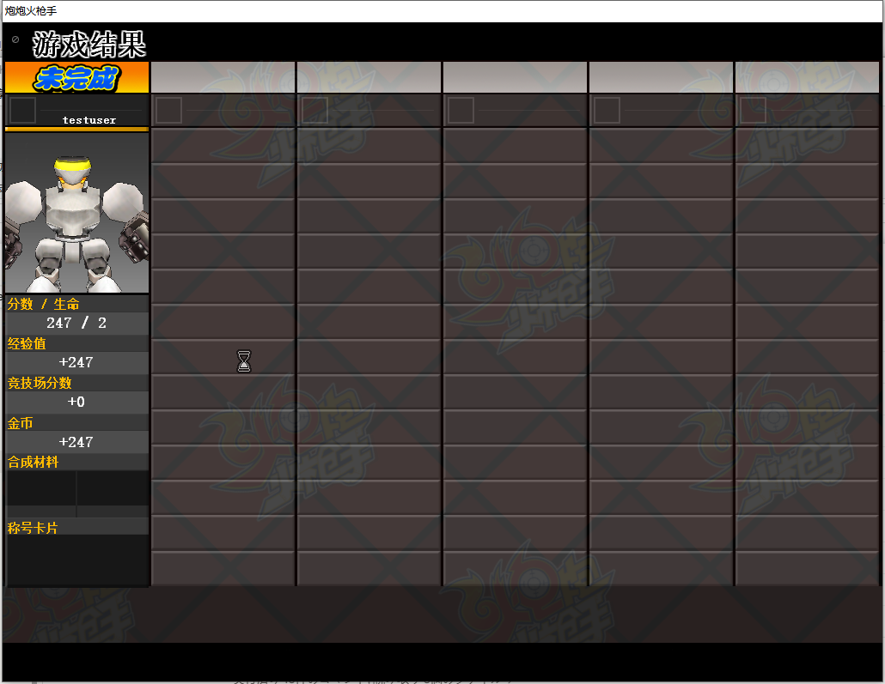

# 炮炮火枪手 · 原版客户端复活工程

这是一个针对 2007 年网络游戏《炮炮火枪手》（NEXON《Big Shot》，世纪天成代理）的客户端保存与复活工程。

该游戏自 2009 年起正式停服，至今没有再开的消息。为了重温童年回忆，现用 AI 技术复活本游戏，项目内代码绝大部分都由 AI 生成。

 > **重要：虽然停服很久，但版权方还在。且玩且珍惜，千万不要拿去跳脸官方。** 

本项目让原版 3.11 客户端能够在 Windows 10 上启动，并通过运行时补丁与本地 Python
替代服务端恢复单机内容。目标是保留登录、大厅、房间、训练场和闯关流程；不连接原官方
服务。

## 当前状态

核心单机闭环已经跑通：

- 绕过已失效的 nProtect GameGuard 检查，进入原版登录界面
- 将认证服和游戏服连接重定向到 `127.0.0.1`
- 登录、账号存档、教程状态、等级、经验和金币持久化
- 大厅、建房、角色选择、训练场和闯关模式
- 关卡开始、换图、死亡、重生、生命数、分数和自动结算
- 怪物与 Boss 掉落、金币/道具生成及拾取
- 通关/失败标签、经验、金币、分数与剩余生命显示
- 结算结束后自动回到房间

当前单机核心功能可玩，但仍有一些bug需要修复。
联机，商店等功能目前还没有，未来可能会加。

## 实机画面

| 闯关战斗 | 结算界面 |
|---|---|
|  |  |

## 工作原理

```text
start.bat
  └─ tools/launch.ps1
       ├─ server/authserver.py      127.0.0.1:47611
       ├─ server/gameserver.py      127.0.0.1:27799
       │    └─ 调试控制通道         127.0.0.1:27800
       └─ hook/bin/bsloader.exe
            └─ game_patched/BigShot.exe
                 └─ 注入 hook/bin/bshook.dll
                      ├─ 延迟执行 GameGuard 状态补丁
                      ├─ 将网络连接重定向到 localhost
                      └─ 可选记录解密后的协议数据
```

`bshook.dll` 不修改磁盘上的 `BigShot.exe`，补丁只在客户端解壳完成后写入进程内存。
本地服务端使用 Python 标准库实现认证、协议编解码和游戏状态机，账号状态保存在
`server/data/accounts.json`。

## 运行要求

当前经过验证的环境：

- Windows 10 Pro 19045 x64
- 原版 3.11 客户端
- Python 3.14
- Visual Studio 2017 Build Tools 的 MSVC x86 工具链
- DirectX 9 运行环境及客户端需要的 VC++ x86 运行库

日常运行服务端不需要第三方 Python 包。部分逆向辅助脚本需要 `capstone`；Ghidra、
x64dbg、Sysinternals 等工具只在继续逆向时需要，正常玩游戏不需要。

当前脚本包含两处本机路径约定：

- `tools/launch.ps1` 默认使用 `C:\Python314\python.exe`
- `hook/build.bat` 默认使用 Visual Studio 2017 Build Tools 的 `vcvars32.bat`

如果安装位置不同，请先修改这两个脚本中的对应变量。


## 启动与关闭

正常游玩：

```bat
start.bat
```

详细协议日志模式：

```bat
start-debug.bat
```

关闭客户端和本地服务端：

```bat
stop.bat
```

登录时可以使用任意测试用户名和密码；本地认证服不校验密码，首次登录会自动创建账号。
请勿使用真实网站或其他服务的密码——本地账号文件和调试日志会以明文记录它。

正常模式只记录关键事件。调试模式会记录逐包 hexdump 和解密后的协议数据，日志体积会
快速增长，文件保存在 `logs/`，且不会提交到 Git。

## 运行测试

服务端测试使用 Python 自带的 `unittest`：

```powershell
Set-Location server
python -m unittest test_account_store test_gameserver
```


## 调试控制通道

`gameserver.py` 默认在 `127.0.0.1:27800` 提供只用于本机协议试验的控制通道：

```powershell
python tools/gs_ctl.py status
python tools/gs_ctl.py help
```

它可以手动触发结算、掉落、死亡、换图和回房间等包，用于快速验证协议，不是正常游玩
流程的一部分。完整命令和注意事项见 [PROGRESS.md](.claude/PROGRESS.md)。

## 目录结构

| 路径 | 内容 |
|---|---|
| `CLAUDE.md` | AI 接手入口和工程铁律 |
| `.claude/` | 计划、进度、结论、决策和会话记录 |
| `hook/` | 注入 DLL、启动器源码及构建脚本 |
| `server/` | 本地认证服、游戏服、协议和测试 |
| `tools/` | 自写逆向、探针、截图和自动化脚本 |
| `re/` | RTTI、虚表、包记录和映射文本等分析成果 |
| `game_patched/` | 实际运行的客户端工作副本 |
| `logs/` | 抓包、运行日志和临时截图 |

`.claude/` 不是可以删除的编辑器缓存。它保存了跨会话继续这项逆向工程所需的事实、
失败路线和设计理由，因此被有意纳入版本控制。新接手者建议依次阅读：

1. [PROGRESS.md](.claude/PROGRESS.md)
2. [FINDINGS.md](.claude/FINDINGS.md)
3. [DECISIONS.md](.claude/DECISIONS.md)
4. [PLAN.md](.claude/PLAN.md)

## 常见问题

### 提示找不到 `bsloader.exe` 或 `bshook.dll`

先运行 `hook\build.bat`。如果找不到编译器，检查 `hook/build.bat` 中的 `VCVARS` 路径，
并确认使用的是 x86 工具链。

### 客户端没有画面或 D3D9 初始化失败

先断开 Sunshine/Moonlight 等正在进行的串流会话，再运行 `tools/d3d9_probe.exe` 检查
D3D9 HAL。串流程序进程存在不一定有问题，关键是当前是否有活跃串流会话。

### 客户端突然退出

优先查看：

```text
game_patched/Dump/LastCrashReport.txt
logs/bshook_*.log
logs/gameserver.err
```

### 关卡中 15 秒不向前移动就被退出

这是原版闯关模式的反挂机机制，不是本地服务端故障。角色重生回出生点后尤其容易触发。

### 运行一段时间后部分贴图变成色块

这是当前已知的原客户端长时间运行问题。退出并重新启动客户端后再判断画面是否异常。


## 版权与用途说明

本项目用于软件保存、兼容性研究和协议逆向学习。
游戏名称、客户端代码、美术、音乐及其他原始内容的权利归其原权利人所有。


